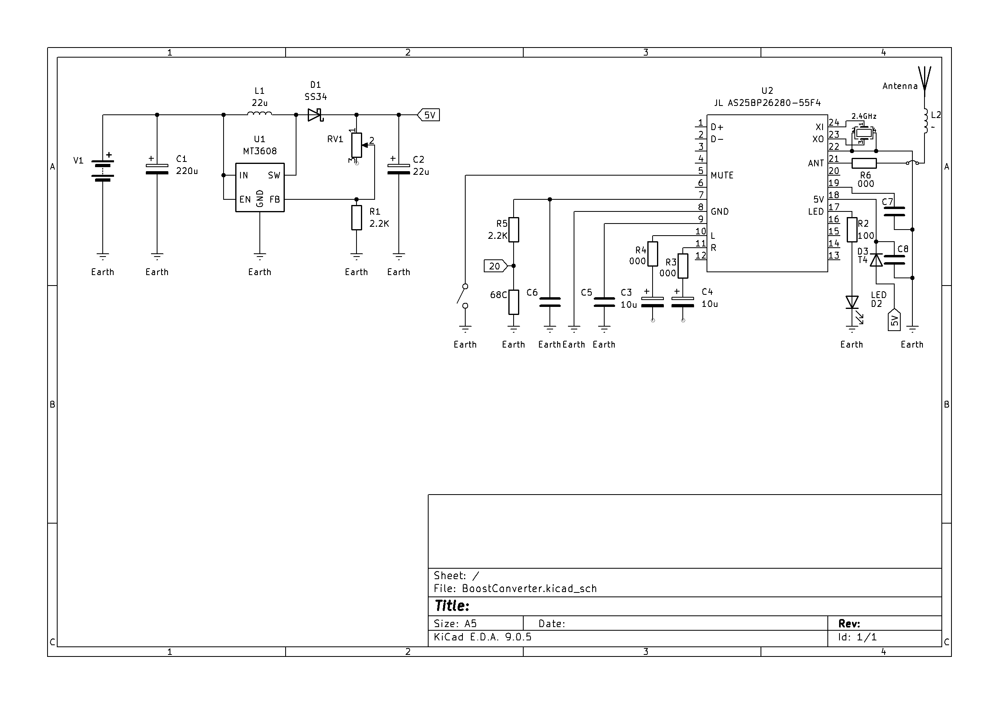
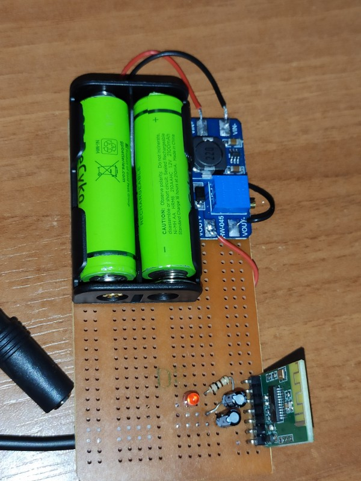
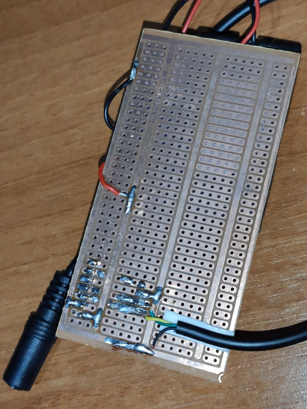

# Bluetooth-Ses-Aktarici

Proje, iki ana modülün entegrasyonunu içermektedir:
1.  **Güç Modülü:** MT3608 tabanlı bir DC-DC Boost Converter
2.  **Sinyal Modülü:** BT4.0 tabanlı bir Bluetooth Ses Vericisi

## 1. Projenin Amacı

Bu projede, düşük voltajlı bir DC güç kaynağı kullanılarak kablolu bir kulaklığın 5V giriş gerektiren bir Bluetooth ses verici modülü ile Bluetooth üzerinden kablosuz kullanılabilmesi amaçlanmıştır.

## 2. Devre Şeması (KiCad Entegrasyon Şeması)

Devre bağlantılarını göstermek amacıyla, MT3608 boost converter uygulama devresi ile BT4.0 modülünün bağlantıları KiCad ortamında düzenlenmiştir.

* `U1` (MT3608), anahtar işleviyle indüktörün dolup boşalmasını sağlayan, geribeslemeyle çıkış gerilimini düzenleyen ana bileşendir.
* `U2` (BT4.0), 5V ile beslenir, Bluetooth ses sinyal girişini alır.
* `D2` (LED), Bluetooth modülünün verici aygıta bağlandığını gösterir.

## 3. Projenin Son Hali (Fotoğraflar)

## 4. Öğrenilenler-Kazanımlar

* **Modül Entegrasyonu:** İki ayrı elektronik modül, birbiriyle uyumlu işleyecek bir biçimde birleştirildi.
* **Güç Elektroniği:** DC-DC `Boost Converter` devrelerin işleyiş biçimi anlaşıldı, uygulama deneyimi edinildi.
* **KiCad:** Proje belgelenmesi için "Şematik Çıkarma" becerisi pekiştirildi.
